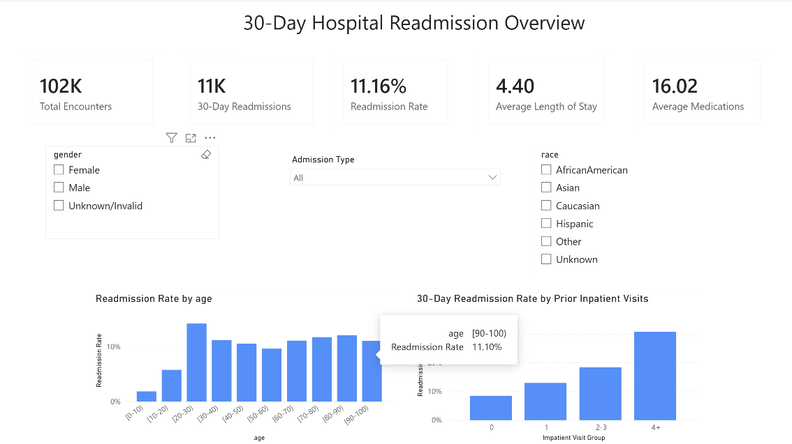
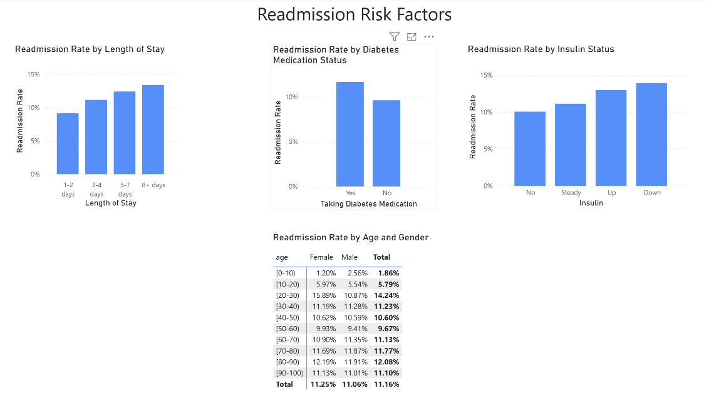

# Predicting 30-day Hospital Readmissions

## TL;DR (Quick Summary)

Developed an end-to-end applied machine learning system for predicting 30-day hospital readmissions using structured EHR data.  
Using a gradient boosting model (XGBoost) improved detection of high-risk patients (recall ~0.54, AUC ~0.64) compared to a logistic regression baseline.  
Results highlight the importance of prior healthcare utilization and disease severity in predicting readmission risk.

## Interactive Dashboard

This project includes an interactive Streamlit dashboard that demonstrates how the model can be used in practice.

It allows users to:

- Explore model performance and threshold tradeoffs
- Understand key drivers of readmission risk
- Simulate patient-level predictions based on input features

This provides a simple prototype of how model outputs and threshold decisions could be used in a clinical workflow.

## Power BI Dashboard

A Power BI dashboard was also developed to explore 30-day hospital readmission patterns and patient risk factors.

The dashboard includes:

- Summary KPIs for total encounters, 30-day readmissions, readmission rate, average length of stay, and average medications
- Interactive filtering by gender, race, and admission type
- Readmission analysis by age and prior inpatient utilization
- Risk factor analysis by length of stay, diabetes medication use, and insulin status
- Age and gender comparisons using a matrix visualization

Power BI features used include:

- Power Query for data preparation and cleaning
- DAX measures for readmission metrics and summary statistics
- Calculated columns for grouping healthcare utilization and length of stay
- Interactive slicers and cross-filtering
- KPI cards, column charts, and matrix visualizations

### Power BI Report


*Figure 1: Power BI overview of 30-day hospital readmissions and prior inpatient utilization.*



*Figure 2: Power BI analysis of readmission risk factors.*

The Power BI report file (.pbix) is available in the powerbi/ directory.

## Overview

In this project, I developed an end-to-end machine learning pipeline to predict 30-day hospital readmissions using structured electronic health record (EHR) data. Since hospital readmissions are costly and often preventable, identifying high-risk patients can support targeted interventions and improve patient outcomes.

## Objectives

- Predict 30-day readmission risk
- Handle class imbalance in clinical data
- Evaluate model performance using appropriate metrics (ROC-AUC, precision, recall)
- Interpret key drivers of readmission risk

## Quick Project Links

- Live dashboard: [View Streamlit App](https://diseaseriskprediction.streamlit.app/)
- [EDA & Preprocessing Notebook](https://github.com/fellington/DiseaseRiskPrediction/blob/main/notebooks/01_preprocessing.ipynb)
- [Modeling Notebook](https://github.com/fellington/DiseaseRiskPrediction/blob/main/notebooks/02_modeling.ipynb)
- [SQL Script](https://github.com/fellington/DiseaseRiskPrediction/blob/main/sql/cohort_extraction.sql)

## Dataset

- Source: [UCI Diabetes 130-US hospitals dataset](https://archive.ics.uci.edu/dataset/296/diabetes+130-us+hospitals+for+years+1999-2008)
- About 100,000 patient encounters included
- Features include:
  - Demographics (e.g. age, gender, race)
  - Clinical variables (e.g. A1C, glucose levels)
  - Medications (e.g. insulin, diabetes medications)
  - Healthcare utilization (e.g. inpatient, outpatient, emergency visits)

## Workflow

### 1. Data Processing

- Queried and validated the dataset from a MySQL backend through Jupyter
- Cleaned the dataset, including removing hidden formatting issues in the `readmitted` field
- Created a clean encounter-level view in SQL
- Created a binary target:
  - 1 = readmitted within 30 days  
  - 0 = readmitted after 30 days or never readmitted  
- Performed preprocessing and feature engineering in Python, including handling missing values and encoding categorical variables

### 2. Model Development (Applied ML)

- **Baseline model: Logistic Regression**  
  - Reason: Provides a simple, interpretable baseline for binary classification and is commonly used in clinical settings. However, its performance is limited when relationships between variables are nonlinear, like in this dataset.
- **Improved model: XGBoost**  
  - Reason: Selected for its strong performance on tabular data, capturing nonlinear relationships and feature interactions. It improves predictive performance over the baseline, particularly in identifying high-risk patients.
- Addressed the class imbalance using:
  - Class weighting
  - scale_pos_weight

### 3. Evaluation

- Metrics used:
  - ROC-AUC
  - Precision/Recall
- Threshold tuning to balance sensitivity vs specificity

## Results

The XGBoost model achieved modest improvements over the baseline, particularly in recall, indicating better detection of high-risk patients.

| Model | ROC-AUC | Recall (30-day readmission) | Precision |
| ----- | ------- | --------------------------- | --------- |
| Logistic Regression | ~0.63 | ~0.45 | ~0.17 |
| XGBoost | ~0.64 | ~0.54 | ~0.17 |

### Threshold Tuning

| Threshold | Recall | Precision |
| --------- | ------ | --------- |
| 0.5 | 0.54 | 0.17 |
| 0.4 | 0.85 | 0.13 |

Lower thresholds improve recall but increase false positives, highlighting the tradeoff in clinical applications.

### ROC Curve


*Figure 3: ROC curve showing model discrimination performance.*

### Feature Importance


*Figure 4: Top 10 features influencing readmission risk.*

## Key Insights

- Prior inpatient visits are the strongest predictor of readmission risk
- Emergency visits and length of stay indicate patient instability and higher healthcare utilization
- A1C levels and diabetes medications reflect the disease severity
- Age shows a nonlinear effect on risk

Overall, the readmission risk is driven by a combination of:

- Healthcare utilization
- Disease severity
- Patient characteristics

## Clinical Relevance

This model could be used to:

- Identify high-risk patients at discharge
- Trigger follow-up interventions
- Support hospital resource allocation

In practice, threshold selection can be adjusted depending on whether the priority is **maximizing detection (recall)** or **minimizing false positives (precision)**.

## Limitations

- Moderate predictive performance (AUC ~0.64)
- Only structured data used (no clinical notes included)
- No temporal modeling of patient history

## Future Work

- Incorporate time-series/longitudinal modeling
- Use unstructured clinical text (NLP)
- Extend the current dashboard with real-time data integration or more advanced modeling

## Tech Stack

- Python (Pandas, NumPy)
- Scikit-learn
- XGBoost
- SQL (MySQL)
- Matplotlib/Seaborn

## Project Structure

```
project/
├── data/
│   └── diabetes_clean.csv
├── app.py
├── notebooks/
│   ├── 01_eda_and_preprocessing.ipynb
│   └── 02_modeling.ipynb
├── sql/
│   └── cohort_extraction.sql
├── images/
│   ├── roc_curve.png
│   └── feature_importance.png
├── requirements.txt
├── README.md
```

## Run the Streamlit Dashboard Locally

To launch the dashboard:

1. Install dependencies:
   `pip install -r requirements.txt`
2. Run:
   `streamlit run app.py`

The app rebuilds the XGBoost model from the notebook configuration and uses the cleaned dataset in `data/`. 

## About Me

PhD-trained computer engineer with experience in healthcare systems and applied data science. This project reflects my transition into industry-focused, applied machine learning, with a focus on healthcare applications.

I am currently seeking data science roles at the intersection of healthcare and machine learning. Feel free to connect with me on [LinkedIn](https://www.linkedin.com/in/floranne-ellington/).
